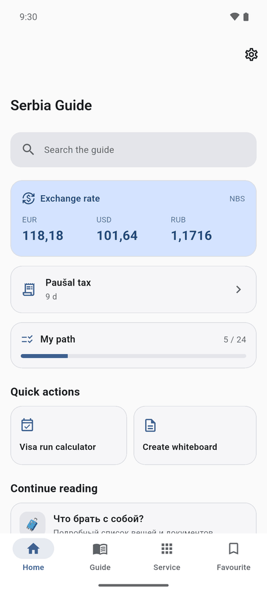
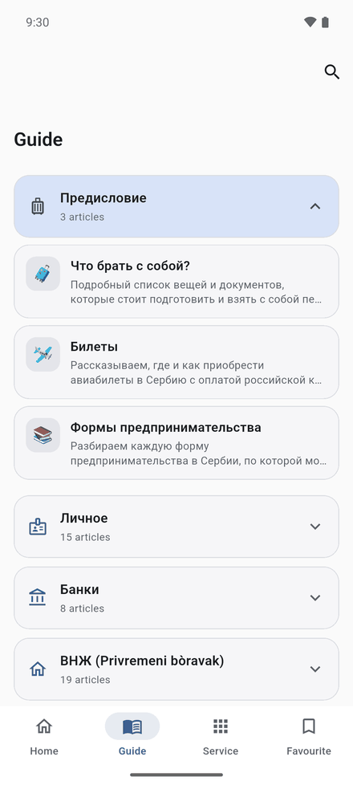
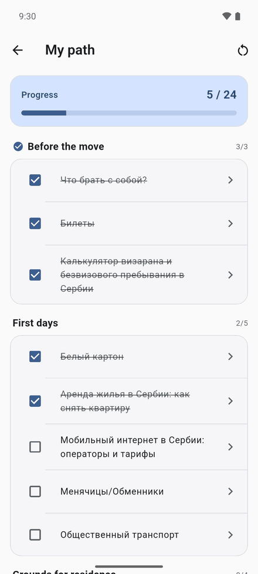
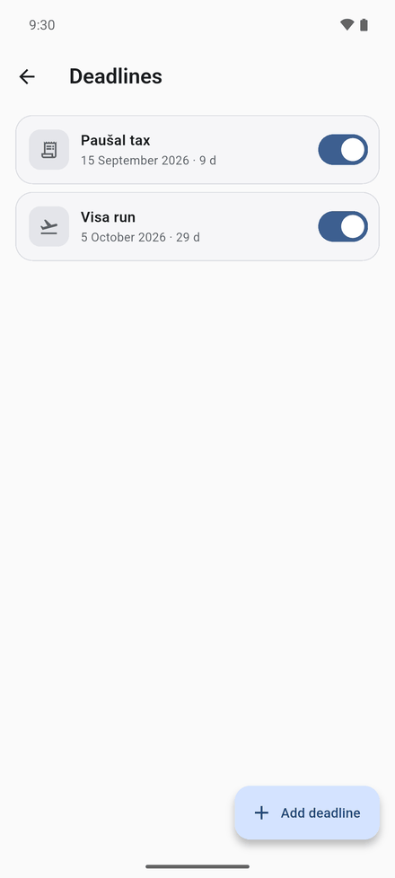
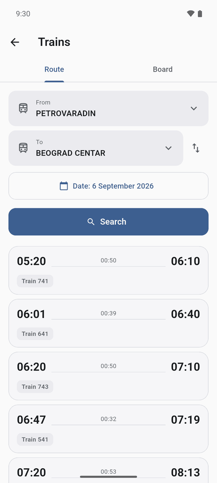
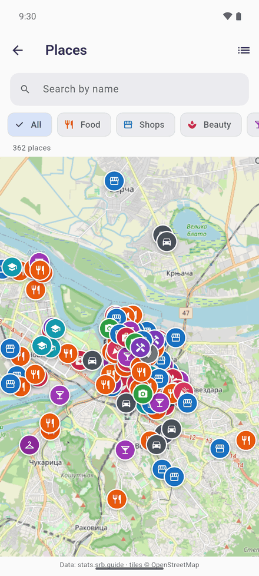
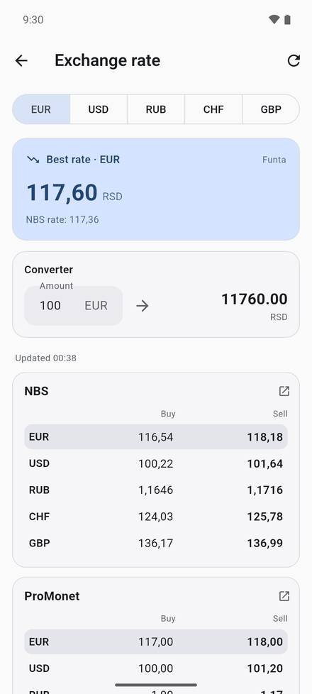

# Serbia Guide

**A Flutter app for people relocating to Serbia.** It answers the questions every newcomer hits in
their first months: what to do next, how many visa-free days are left, when the next tax deadline
is, how to fill in a *beli karton*, and where today's best exchange rate is.

<p>
  <a href="https://play.google.com/store/apps/details?id=com.alakey.serbiaguide">
    
  </a>
  
  
  
</p>

---

## Screenshots

<p float="left">
  
  
  
  
</p>
<p float="left">
  
  
  
  
</p>

<sub>Android 16 emulator. Interface is shown in English; it also ships in
Russian, which is the language the guide content itself is written in.</sub>

---

## Features

### Guide
74 articles across 8 sections, mirrored from [srb.guide](https://www.srb.guide/) with the authors'
permission and bundled as Markdown in `assets/data/guide.json`. Every article keeps its source URL
and last-modified date, and links back to the original.

**Article text works with no connection**, which matters on day one in a new country. Images are
loaded from srb.guide when the device is online and fall back to a placeholder when it is not.

Search covers titles, summaries and body text. The query is stemmed, so the Russian "банка" also
finds "банки" and "банковский" — a full morphological analyser would be overkill over 1.5 MB of
text, so only the query is stemmed and matched as a prefix. Results are ranked title-first, filter
by section, and show the snippet that matched.

Because the weekly workflow commits the re-scraped guide to `master`, the app also checks GitHub
for a newer copy once a day, conditional on an `ETag` so an unchanged guide costs a single 304 and
no body transfer. A correction on srb.guide therefore reaches users in days rather than waiting for
a Play release. The download is validated before it is accepted and the bundled asset stays the
fallback, so a bad fetch can never leave the app without content.

### "My path" checklist
The guide explains *how* to do each thing; the checklist says *what to do next*. 24 steps across
six stages, each linked to the article that explains it. Steps bind to articles by slug rather than
title, so they survive a content re-sync.

### Deadline reminders
Tracks visa runs, residence-permit renewal, paušal tax (the 15th of each month), eco tax
(30 April), health insurance and document expiry, and notifies ahead of each one. Dates are derived
from what the obligation is, so most reminders need no data entry, and the monthly and yearly ones
roll forward on their own.

Scheduling is deliberately **inexact**: exact alarms require `SCHEDULE_EXACT_ALARM` /
`USE_EXACT_ALARM`, which Google Play grants only to alarm and calendar apps. Reminders survive a
reboot via the plugin's boot receiver.

### Live exchange rates
Five sources: the **National Bank of Serbia** official rate, plus four Belgrade exchange offices.
The NBS publishes JSON; the offices don't, so their public pages are scraped by one parser each in
`lib/service/parser/`, matching rows **by currency code** rather than by row and column position —
these sites renumber their tables, and positional parsing fails silently when they do.

Sources are queried in parallel and each card reports its own failure with a retry, so one dead
site doesn't empty the screen. The best rate is highlighted (the NBS reference is excluded — it
isn't a counter you can walk up to), the last successful fetch is cached for offline use, and a
converter uses the best rate.

### Train timetable
Serbian Railways' own site is awkward on a phone. The app talks to the same endpoints it does: a
JSON station lookup, plus route search and a per-station departure/arrival board. Stations you have
used are remembered, so the usual trip takes two taps.

### Map of relocant-run businesses
362 places — cafés, shops, salons, garages — from the stats.srb.guide catalogue, on an
**OpenStreetMap** map. OSM needs no API key and no billing account, unlike the Google Maps SDK.
The catalogue is bundled, so the list and filters work offline; only the tiles need a connection.
Each place links out to Google Maps for directions.

### Visa-free stay calculator
Enter your entry date and the app tracks the remaining days of the 29-day visa-free window, shows
the exit deadline, and can push the date into the system calendar via `add_2_calendar`.

### White cardboard (*beli karton*) generator
Address registration means filling in the same form by hand every time you move. The app stores
your data once and renders a ready-to-print `.docx` from a bundled template
(`assets/template/cardboard.docx`) using `docx_template`, then hands it to the system share sheet.

### Map of useful places
A curated set of Google Maps links — exchange offices, cafés, expat-friendly venues — defined in
`assets/data/locations.json` and shown in an embedded `webview_flutter` view with a dropdown.
Requests that the page hands off to a native app (`intent://`, `geo:`) are opened through the
platform instead of failing inside the web view.

### Telegram directory
432 relocation chats and channels (`assets/data/tg_chats.json`), synced weekly from the
stats.srb.guide catalogue along with their topic, size and whether they are still active, and
opened in the Telegram app through `url_launcher`.

### Personalisation
Light/dark theme, RU/EN interface, a configurable start tab, and per-article text size — persisted
with `shared_preferences`. The interface language defaults to the device language, falling back to
Russian, which is the language the guide itself is written in.

---

## Tech stack

| Area | Choice |
|---|---|
| Framework | Flutter 3.47, Dart 3 |
| Android | AGP 9.1, Gradle 9.3.1, Kotlin 2.4, Java 17, `compileSdk`/`targetSdk` 36, `minSdk` 24 |
| UI | Material 3 — one seeded `ColorScheme`, surface family kept neutral |
| Maps | `flutter_map` + OpenStreetMap tiles (no API key) |
| State | `provider` for the locale, `setState` for local screen state |
| Persistence | `shared_preferences` (theme, language, start tab, favourites, deadlines, checklist) |
| Localisation | `flutter_localizations` + ARB files (`lib/l10n/app_en.arb`, `app_ru.arb`), `intl` |
| Content | Offline JSON + Markdown in `assets/data/`, rendered with `flutter_markdown_plus` |
| Scraping | `http` + `html` — exchange offices, the railway timetable, the sync tools |
| Reminders | `flutter_local_notifications`, `timezone`, `flutter_timezone` |
| Documents | `docx_template` + `xml`, `path_provider`, `open_file` / `share_plus` to export |
| Integrations | `add_2_calendar`, `url_launcher`, `webview_flutter`, `photo_view` |
| CI | GitHub Actions — checks, weekly content sync, signed release, daily parser health |

---

## Project structure

```
lib/
├── main.dart                        # bootstrap: prefs, locale, theme, warm caches
├── data/
│   ├── guide_dto.dart               #   guide content model
│   ├── guide_repository.dart        #   single cached load, search, favourites, history
│   ├── deadline.dart                #   deadline kinds and their default schedules
│   ├── deadline_repository.dart
│   ├── journey.dart                 #   the relocation checklist
│   ├── place.dart                   #   map catalogue
│   ├── train.dart                   #   timetable model
│   └── currency_rate.dart
├── screens/
│   ├── app_shell.dart               #   NavigationBar: Home / Guide / Services / Saved
│   ├── home.dart                    #   search, rate, next deadline, checklist progress
│   ├── guide.dart                   #   collapsible sections
│   ├── article.dart                 #   reader: text size, bookmark, source link
│   ├── guide_search.dart            #   stemmed full-text search
│   ├── favourites.dart
│   ├── journey.dart                 #   "my path" checklist
│   ├── deadlines.dart               #   reminders
│   ├── exchange_rate.dart           #   best rate, NBS reference, converter
│   ├── trains.dart                  #   route search + station board
│   ├── places.dart                  #   OpenStreetMap map of the catalogue
│   ├── calculator.dart              #   visa-free day counter + calendar export
│   ├── white_cardboard.dart         #   .docx form generation
│   ├── services.dart, map.dart, tg_chats.dart
│   └── author.dart, settings.dart
├── service/
│   ├── exchange_rate_service.dart   # parallel fetch, offline cache, best rate
│   ├── srbijavoz_service.dart       # railway timetable
│   ├── content_update_service.dart  # ETag-conditional guide refresh
│   ├── notification_service.dart    # reminder scheduling
│   ├── document_generate.dart       # .docx rendering from template
│   ├── url_launcher_helper.dart
│   └── parser/                      # NBS + one scraper per exchange office
├── theme/app_theme.dart             # Material 3, neutral surfaces + blue accent
├── utils/                           # search stemming, section icons
├── widget/                          # markdown renderer, tiles, form fields
├── dialogs/, localization/, l10n/, provider/
tool/
├── sync_guide.dart                  # srb.guide      -> assets/data/guide.json
├── sync_places.dart                 # map catalogue  -> assets/data/places.json
├── sync_chats.dart                  # chat directory -> assets/data/tg_chats.json
└── validate_guide.dart              # sanity gate before content is committed
test/                                # unit tests + network-tagged live checks
```

---

## Running locally

```bash
git clone https://github.com/ialakey/srbguide.git
cd srbguide
flutter pub get
flutter run
```

No API keys or backend are required — the app ships its content offline and reaches the network
only for exchange rates and guide images.

Checks, as CI runs them:

```bash
dart format --output=none --set-exit-if-changed lib tool test
flutter analyze
flutter test --exclude-tags live      # unit tests
flutter test test/exchange_parsers_live_test.dart   # hits the real exchange sites
dart run tool/validate_guide.dart
```

Refresh the bundled datasets from their sources:

```bash
dart run tool/sync_guide.dart     # 74 guide articles
dart run tool/sync_places.dart    # 362 map places
dart run tool/sync_chats.dart     # 432 Telegram chats
```

Release builds and signing are documented in [`docs/RELEASE.md`](docs/RELEASE.md).

---

## Continuous integration

| Workflow | Trigger | What it does |
|---|---|---|
| `ci.yml` | push / PR | format, analyze, tests, guide validation, debug build |
| `sync-content.yml` | weekly | re-scrapes all three datasets, validates, commits real changes |
| `release.yml` | tag `v*` | signed AAB + APK, verifies the signature, draft release |
| `parsers.yml` | daily | runs the parsers against the live sites, opens an issue on failure |

`sync-content.yml` commits third-party content unattended, so `tool/validate_guide.dart` gates
it: section and article counts, per-article length, duplicate source URLs, and a rejection if the
bundle shrank by more than 25% against the previous one. Only datasets whose payload actually
changed are staged, so a new sync timestamp alone never produces a commit.

`release.yml` refuses to publish anything questionable — it checks that the upload key is
`SHA256withRSA`, that the APK carries APK Signature Scheme v2 with a SHA-256 certificate digest,
that it is not the Android debug certificate, and that the merged manifest still targets SDK 36.

`parsers.yml` exists because scraper breakage is silent: an office redesigns its page, the parser
returns nothing, and the screen simply looks empty. Running the live tests on a schedule means CI
notices before users do.

---

## Platforms

Android is the maintained and released target. An `ios/` project is present in the repository but
is not currently built or verified — it has no `Podfile` and still declares an iOS 11 deployment
target, below what the current plugin set requires.

---

## Notes

The exchange-rate and timetable parsers depend on the HTML of third-party sites and will break
when those sites are redesigned. Each parser is isolated so a broken source degrades that one card
rather than the screen, and each reports its own failure with a retry.

Map tiles come from the public OpenStreetMap tile servers, which are donation-funded. The app
identifies itself as their tile usage policy requires; if it ever grows into heavy traffic, the
right move is a dedicated tile provider rather than leaning harder on theirs.

Guide content belongs to the authors of srb.guide and is used with their permission; see
[`NOTICE`](NOTICE). The MIT licence in [`LICENSE`](LICENSE) covers the source code only.

---

## Author

Ilia Alakov — [LinkedIn](https://www.linkedin.com/in/ilia-alakov/) ·
[GitHub](https://github.com/ialakey) · [Medium](https://medium.com/@alakov.ilia) ·
[Habr](https://habr.com/ru/users/i_alakey/) · alakov.ilia@gmail.com
